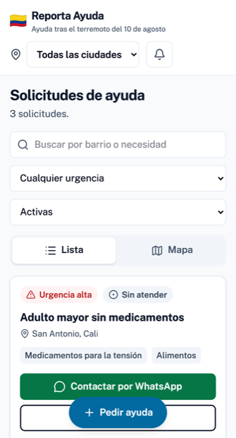

# Reporta Ayuda

Plataforma de ayuda durante la emergencia por el terremoto del 10 de agosto de
2026 en Colombia. Quien necesita algo lo publica con su ubicación; quien puede
ayudar lo ve en un mapa o en una lista y lo contacta por WhatsApp.

En producción: **[reportayuda.com](https://reportayuda.com)** — cubre Cali,
Armenia, Pereira, Buenaventura y Quibdó.



## Por qué existe

Después de un terremoto la ayuda no falta: falta saber dónde hace falta. La
información se dispersa en grupos de WhatsApp y publicaciones sueltas, y
termina duplicada en unos barrios y ausente en otros.

Esto es lo más simple que resuelve eso: un tablero público de necesidades con
ubicación, para que un voluntario vea qué falta cerca y quién ya va en camino.

## Cómo funciona

1. **Alguien pide ayuda.** Un formulario: qué pasa, qué necesita, dónde
   (marcando un punto en el mapa) y su WhatsApp. Sin registrarse.
2. **Recibe un enlace privado.** Es su única llave para editar, cerrar o
   borrar la solicitud. No hay contraseñas que recordar ni recuperar.
3. **Un voluntario la encuentra** en la lista o el mapa, filtrando por ciudad
   y urgencia.
4. **Pulsa "Voy en camino".** Queda visible para todos durante 6 horas, para
   que no se duplique el esfuerzo. Si no llega, la solicitud vuelve sola a la
   lista.
5. **Contacta por WhatsApp** y, cuando entrega, quien pidió marca la solicitud
   como atendida.

## Decisiones que quizá sorprendan

Casi todas nacen de la misma pregunta: qué pasa si esto lo usa alguien que
acaba de perder su casa, desde un Android viejo, con datos contados.

- **Sin cuentas de usuario.** Registrarse es una barrera en una emergencia, y
  guardar contraseñas es un riesgo que no hace falta correr. La autoría se
  demuestra con un token que va en el enlace privado.
- **Sin correo electrónico ni SMS.** Ningún dato sale de la plataforma hacia
  un tercero, y no hay servidor de correo que comprometer. Los avisos ocurren
  dentro de la página.
- **El teléfono nunca es público.** No aparece en la lista, ni en el mapa, ni
  en el HTML. Se entrega solo a quien pulsa el botón de contacto, con un
  límite por hora y por IP para que nadie recolecte los números de todas las
  personas afectadas. Es exactamente el material con el que operan las
  campañas de estafa tras cada desastre.
- **Las IP se guardan con HMAC-SHA256, no con SHA-256 a secas.** El espacio de
  direcciones IPv4 completo se revierte por fuerza bruta en minutos; sin un
  secreto, "hashear" la IP no la anonimiza.
- **OpenStreetMap y no Google Maps.** No pide tarjeta de crédito ni puede
  cortarse por superar una cuota justo el día que más se usa.
- **Sin PostGIS.** La búsqueda por cercanía es la fórmula del haversine
  escrita en SQL. Una dependencia menos que instalar con prisa.
- **Los datos se borran solos.** Dos meses después de que una solicitud se
  cierra, el nombre, el teléfono y la dirección desaparecen y queda solo el
  barrio y qué se necesitaba. Cuando la emergencia termine, se elimina la base
  entera.
- **Sin analítica ni rastreadores.** No hay cookies de terceros.
- **El color nunca es el único indicador.** Cada distintivo de urgencia
  combina icono, texto y color: hay que poder leerlo con daltonismo y a pleno
  sol.

## Puesta en marcha

Hace falta Node.js 22 o superior y un PostgreSQL 17.

```bash
git clone https://github.com/ndorado1/reporta_ayuda.git
cd reporta_ayuda
npm ci
cp .env.example .env
```

Rellena `.env`. Los tres secretos se generan con `openssl rand -base64 32`:

| Variable | Para qué |
|---|---|
| `DATABASE_URL` | Conexión a PostgreSQL |
| `TEST_DATABASE_URL` | Base aparte para las pruebas; **se vacía sin aviso** |
| `IP_HASH_SECRET` | Clave del HMAC con el que se guardan las IP |
| `ADMIN_TOKEN` | Contraseña de `/admin` |
| `ADMIN_COOKIE_SECRET` | Firma de la sesión de `/admin` |
| `NEXT_PUBLIC_SITE_URL` | Dominio público, para las tarjetas al compartir |

Crea el esquema y arranca:

```bash
npm run db:migrate
npm run db:seed     # inserta las cinco ciudades
npm run dev
```

En [localhost:3000](http://localhost:3000).

## Pruebas

```bash
npm test    # 198 pruebas unitarias y de integración (Vitest)
npm run e2e # 5 recorridos completos en un móvil (Playwright)
```

Las de integración corren contra `TEST_DATABASE_URL` de verdad, no con la base
de datos simulada: la mayor parte de la lógica vive en consultas SQL, y una
simulación las daría por buenas sin ejecutarlas.

## Estructura

```
src/
  app/          Rutas y Server Actions (App Router)
  components/   Interfaz
  db/           Esquema de Drizzle y semilla
  lib/          Toda la lógica de dominio: solicitudes, ofrecimientos,
                notificaciones, límites por IP, mantenimiento
  test/         Utilidades de la base de pruebas
drizzle/        Migraciones generadas
e2e/            Pruebas de extremo a extremo
nginx/          Configuración del proxy inverso
docs/           Despliegue, y el diseño y el plan con que se construyó
design-system/  Decisiones visuales y por qué
```

`docs/superpowers/` guarda el documento de diseño y el plan de implementación
originales. No son historia muerta: explican por qué el código es como es.

## Despliegue

En [`docs/DESPLIEGUE.md`](docs/DESPLIEGUE.md), paso a paso, con Docker, nginx y
Let's Encrypt. Incluye tres comprobaciones de seguridad **obligatorias** antes
de anunciar el sitio: si la aplicación queda accesible sin pasar por el proxy,
el límite que protege los teléfonos deja de servir.

El mantenimiento diario (`npm run maintenance`) tiene que quedar programado en
`cron`. Es lo que cumple la promesa de borrar los datos personales; sin él, la
política de privacidad es papel mojado.

## Datos personales

El tratamiento se hace conforme a la **Ley 1581 de 2012** de protección de
datos personales de Colombia. La política está escrita en lenguaje llano en
`/privacidad` y describe lo que el código realmente hace, ni más ni menos.

Si adaptas esto a otro país, revisa esa página: es una promesa a personas en
una situación vulnerable, no un texto de relleno.

## Adaptarlo a otra emergencia

Está pensado para que sirva en el próximo desastre, aquí o en otro país:

- **Ciudades:** viven en una tabla, no en el código. Un `INSERT` en `cities`
  habilita una ciudad nueva sin desplegar nada.
- **Textos:** la interfaz está en español y menciona el terremoto del 10 de
  agosto en la cabecera, los metadatos y la página de privacidad.
- **Umbrales:** los límites por hora están en `src/lib/ratelimit.ts` —altos a
  propósito, porque los operadores móviles colombianos usan CGNAT y mucha
  gente comparte una IP pública—; los plazos de borrado, en
  `src/lib/maintenance.ts`; la duración de un ofrecimiento, en
  `src/lib/claims.ts`.

## Contribuir

Los informes de errores y los parches son bienvenidos, sobre todo si vienen de
haberlo usado en una emergencia real.

Dos cosas antes de abrir un pull request:

- **Que las pruebas pasen**, y que lo que añadas traiga la suya. El criterio
  aquí es concreto: una prueba que no falle contra el código roto no prueba
  nada. Compruébalo rompiéndolo a propósito.
- **Comenta el porqué, no el qué.** El código de este repositorio explica las
  decisiones que no son obvias, para que nadie las deshaga sin querer.

## Tecnología

Next.js 16 (App Router), TypeScript, Tailwind CSS 4, Drizzle ORM, PostgreSQL,
Leaflet con OpenStreetMap, Vitest y Playwright.

## Licencia

[MIT](LICENSE) © 2026 Antonio Dorado. Cópialo, adáptalo y despliégalo donde
haga falta; solo conserva el aviso de copyright.
